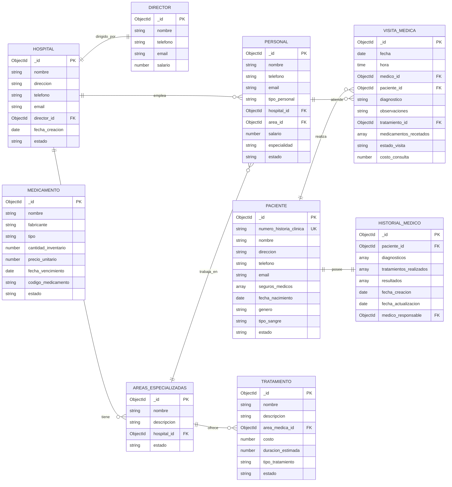

# Projecto: Sistema de Gestión Hospitalaria MongoDB


                                Sistema de Gestión Hospitalaria MongoDB


                                      Juan David Saavedra Jaimez

                                         Juan José Abril Román


                                                 S1

                                      Pedro Felipe Gómez Bonilla


                                            CAMPUSLANDS

                                            RUTA NODE JS

                                        BUCARAMANGA, SANTANDER

                                                2025

##  Descripción del Projecto

El **Sistema de Gestión Hospitalaria** es una base de datos diseñada en MongoDB para centralizar y optimizar la administración integral de instituciones médicas. Su objetivo principal es proporcionar una plataforma robusta que permita gestionar eficientemente todos los aspectos operativos de un hospital, desde la administración del personal hasta el seguimiento detallado de pacientes y tratamientos.

Ademas de que en este sistema abarca la gestión completa de un ecosistema hospitalario moderno, integrando múltiples componentes críticos en una solución unificada. La base de datos está estructurada para manejar hospitales con múltiples áreas especializadas, cada una con su propio personal médico y administrativo, mientras mantiene un control centralizado bajo la supervisión de directores generales.

## Tabla de Contenidos
[1. Introducción]()

[2. Tecnologías Utilizadas]()

[3. Requisitos Previos]()

[4. Instalación y Puesta en Marcha]()

[5. Caso de Estudio]()

[6. Estructura de la Base de Datos]()

[7. Consultas a la Base de Datos]()

[8. Autor]()

## Introducción

En la era digital actual, los sistemas de salud enfrentan desafíos crecientes en la gestión eficiente de grandes volúmenes de información médica, administrativa y operacional. La necesidad de integrar múltiples procesos hospitalarios en una plataforma unificada se ha vuelto crítica para mejorar la calidad de atención al paciente y optimizar los recursos institucionales.
El Sistema de Gestión Hospitalaria surge como respuesta a esta necesidad, ofreciendo una solución integral desarrollada sobre MongoDB, una base de datos NoSQL que proporciona la flexibilidad y escalabilidad requeridas para manejar la complejidad inherente de las operaciones médicas modernas.

## Tecnologías Utilizadas


#### **Motor de Base de Datos**

-   **MongoDB Community/Enterprise Server**: Versión 6.0 o superior
-   **Plataformas Compatibles**: macOS 10.14+, Ubuntu 18.04+, CentOS 7+

#### **Herramientas de Administración**

-   **MongoDB Compass**: Versión 1.35 o superior (Interfaz gráfica recomendada)
-   **MongoDB Shell (mongosh)**: Versión 1.6 o superior

#### **Entorno de Desarrollo**
-   **Java**: JDK 8+ con MongoDB Java Driver 4.8+
- 
## Instalación y Configuración

Sigue estos pasos para poner en funcionamiento el proyecto en tu entorno local:

1.  **Clonar el repositorio**:
```bash
git clone https://github.com/Juan-771/Proyecto_MongoDB2_S1_AbrilJuan_SaavedraJuan

cd Proyecto_MongoDB2_S1_AbrilJuan_SaavedraJuan

```


2.  Ten por seguro que el servicio **MongoDB**  este corriendo en tu Maquina o Dispositivo 
    
3.  **Cargar los datos de prueba**: Busca dónde está ubicado el archivo  **JS**. Luego, abre  `mongosh`  desde MongoDB Compass, selecciona tu base de datos y carga el script:
    
    **En la terminal de mongosh**
  ```
    use miHospitalDB
    load('ruta/a/tu/archivo/insercion_datos.js')
```
Esto creará y poblará todas las colecciones necesarias

## Caso de Estudio
El sistema debe presentar una estructura que permita gestionar múltiples áreas especializadas dentro de un mismo hospital, como cardiología o neurología. Cada hospital cuenta con un director general, aunque un mismo director puede estar a cargo de más de un hospital. El personal está compuesto por médicos, enfermeros, personal administrativo y de mantenimiento, y todos deben ser gestionados dentro del sistema. Es fundamental que cada hospital mantenga un historial completo de pacientes, incluyendo los tratamientos realizados.

Los pacientes se identifican mediante un número de historia clínica, además de contar con datos personales como nombre, dirección, teléfono, correo electrónico y seguros médicos. Sus historiales médicos deben incluir diagnósticos, tratamientos recibidos y los resultados obtenidos.

En cuanto al personal médico, los doctores deben registrarse con su número de colegiatura, nombre, especialidad, datos de contacto y salario. El sistema debe contemplar distintos tipos de personal, incluyendo directores generales encargados de la gestión global del hospital, médicos especialistas que atienden y diagnostican a los pacientes, enfermeros que asisten en los cuidados médicos, personal administrativo que maneja los recursos y la logística, y personal de mantenimiento responsable de las instalaciones.

Los tratamientos médicos se deben registrar con información como su nombre, una descripción, el área médica a la que pertenecen y su costo. Los medicamentos, por su parte, se gestionan según su nombre, fabricante, tipo y la disponibilidad en el inventario.

Las visitas médicas deben quedar documentadas con la fecha y hora, el médico que atendió, el paciente involucrado y el diagnóstico correspondiente. El sistema debe permitir el registro de múltiples visitas para un mismo paciente a lo largo del tiempo.

## Modelo Conceptual

El diseño conceptual del Sistema de Gestión Hospitalaria desarrollado en MongoDB se fundamenta en la modelación de las entidades fundamentales y sus interconexiones dentro del ecosistema de atención médica. Los componentes esenciales incluyen Centros Hospitalarios, Departamentos Especializados, Usuarios Pacientes, Equipo Médico y Administrativo, Procedimientos Terapéuticos, Fármacos y Consultas Médicas.

Cada centro hospitalario tiene la capacidad de administrar diversos departamentos y está liderado por un director ejecutivo, además de contar con doctores, personal de enfermería y equipos de soporte. Los usuarios pacientes mantienen expedientes médicos completos que abarcan evaluaciones diagnósticas, procedimientos terapéuticos y medicación suministrada, junto con un historial detallado de consultas médicas.

Esta arquitectura pretende organizar los datos de forma adaptable y con capacidad de crecimiento, maximizando los beneficios del paradigma documental que ofrece MongoDB.

# Estructura Base de Datos

### Diagrama de la Base de Datos


## Decripción de la estructura

El sistema emplea un modelo de datos híbrido. Las entidades centrales, como el personal, los pacientes y los hospitales, se almacenan en colecciones independientes (normalizadas) con el fin de asegurar la integridad y facilitar la escalabilidad. En cambio, la información estrechamente vinculada, como el historial de cada paciente, se guarda de forma incrustada (desnormalizada) para mejorar el rendimiento en las consultas de lectura.

A continuación, se detalla cada colección:

##

```

```


## Consultas a la Base de Datos

El propósito consiste en desarrollar 100 consultas que permitan examinar la información desde múltiples enfoques. A continuación, se presentan las consultas realizadas.


# Desarrollado Por

Juan David Saavedra Jaimez - [Linkedin](https://www.linkedin.com/in/juan-david-saavedra-jaimez-636239374/) - [Github](https://github.com/wilskirby)

Juan José Abril Román - [Linkedin]() - [Github](https://github.com/Juan-771)
