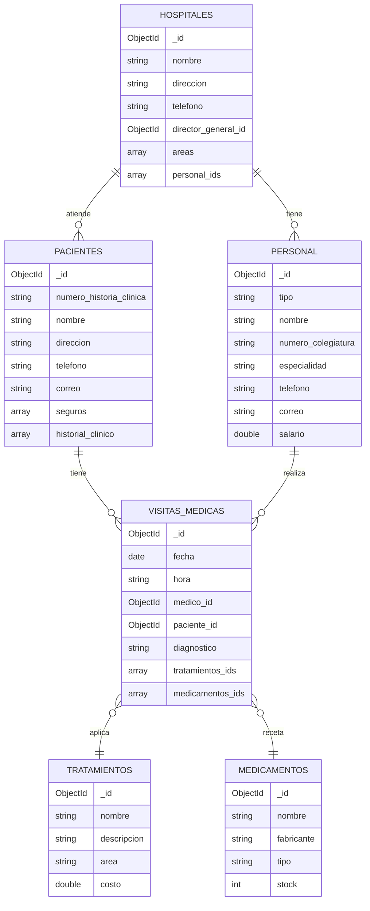
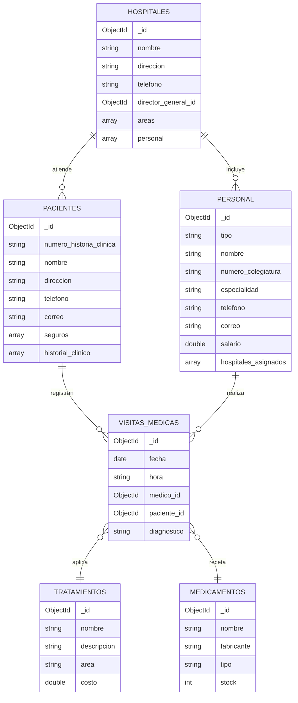
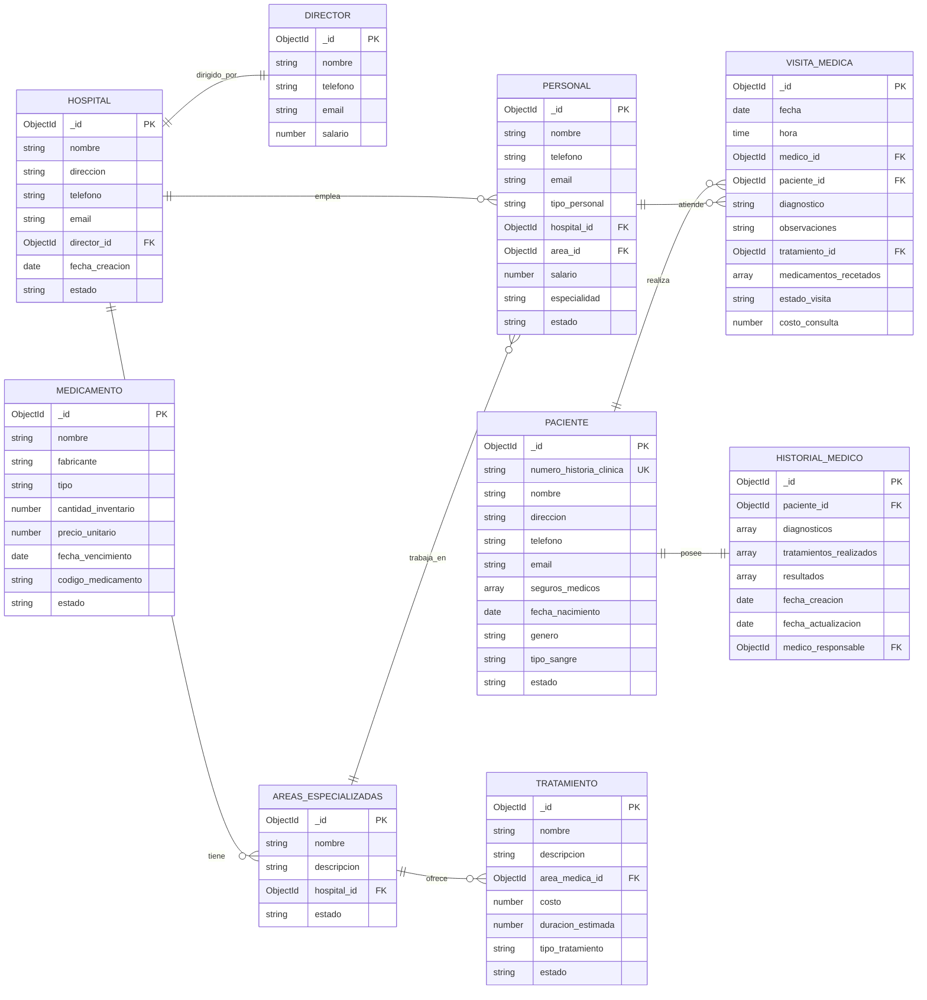

# Projecto: Sistema de Gestión Hospitalaria MongoDB


                                Sistema de Gestión Hospitalaria MongoDB


                                      Juan David Saavedra Jaimez

                                         Juan José Abril Román


                                                 S1

                                      Pedro Felipe Gómez Bonilla


                                            CAMPUSLANDS

                                            RUTA NODE JS

                                        BUCARAMANGA, SANTANDER

                                                2025

##  Descripción del Projecto

El **Sistema de Gestión Hospitalaria** es una base de datos diseñada en MongoDB para centralizar y optimizar la administración integral de instituciones médicas. Su objetivo principal es proporcionar una plataforma robusta que permita gestionar eficientemente todos los aspectos operativos de un hospital, desde la administración del personal hasta el seguimiento detallado de pacientes y tratamientos.

Ademas de que en este sistema abarca la gestión completa de un ecosistema hospitalario moderno, integrando múltiples componentes críticos en una solución unificada. La base de datos está estructurada para manejar hospitales con múltiples áreas especializadas, cada una con su propio personal médico y administrativo, mientras mantiene un control centralizado bajo la supervisión de directores generales.

## Tabla de Contenidos
[1. Introducción]()

[2. Tecnologías Utilizadas]()

[3. Requisitos Previos]()

[4. Instalación y Puesta en Marcha]()

[5. Caso de Estudio]()

[6. Construcción del Modelo Conceptual]()

[7. Construcción del Modelo Lógico]()

[8. Construcción del Modelo Físico]()

[9. Estructura de la Base de Datos]()

[10. Consultas a la Base de Datos]()

[11. Autor]()

## Introducción

En la era digital actual, los sistemas de salud enfrentan desafíos crecientes en la gestión eficiente de grandes volúmenes de información médica, administrativa y operacional. La necesidad de integrar múltiples procesos hospitalarios en una plataforma unificada se ha vuelto crítica para mejorar la calidad de atención al paciente y optimizar los recursos institucionales.
El Sistema de Gestión Hospitalaria surge como respuesta a esta necesidad, ofreciendo una solución integral desarrollada sobre MongoDB, una base de datos NoSQL que proporciona la flexibilidad y escalabilidad requeridas para manejar la complejidad inherente de las operaciones médicas modernas.

## Tecnologías Utilizadas


#### **Motor de Base de Datos**

-   **MongoDB Community/Enterprise Server**: Versión 6.0 o superior
-   **Plataformas Compatibles**: macOS 10.14+, Ubuntu 18.04+, CentOS 7+

#### **Herramientas de Administración**

-   **MongoDB Compass**: Versión 1.35 o superior (Interfaz gráfica recomendada)
-   **MongoDB Shell (mongosh)**: Versión 1.6 o superior

#### **Entorno de Desarrollo**
-   **Java**: JDK 8+ con MongoDB Java Driver 4.8+
- 
## Instalación y Configuración

Sigue estos pasos para poner en funcionamiento el proyecto en tu entorno local:

1.  **Clonar el repositorio**:
```bash
git clone https://github.com/Juan-771/Proyecto_MongoDB2_S1_AbrilJuan_SaavedraJuan

cd Proyecto_MongoDB2_S1_AbrilJuan_SaavedraJuan

```


2.  Ten por seguro que el servicio **MongoDB**  este corriendo en tu Maquina o Dispositivo 
    
3.  **Cargar los datos de prueba**: Busca dónde está ubicado el archivo  **JS**. Luego, abre  `mongosh`  desde MongoDB Compass, selecciona tu base de datos y carga el script:
    
    **En la terminal de mongosh**
  ```
    use miHospitalDB
    load('ruta/a/tu/archivo/insercion_datos.js')
```
Esto creará y poblará todas las colecciones necesarias

## Caso de Estudio
El sistema debe presentar una estructura que permita gestionar múltiples áreas especializadas dentro de un mismo hospital, como cardiología o neurología. Cada hospital cuenta con un director general, aunque un mismo director puede estar a cargo de más de un hospital. El personal está compuesto por médicos, enfermeros, personal administrativo y de mantenimiento, y todos deben ser gestionados dentro del sistema. Es fundamental que cada hospital mantenga un historial completo de pacientes, incluyendo los tratamientos realizados.

Los pacientes se identifican mediante un número de historia clínica, además de contar con datos personales como nombre, dirección, teléfono, correo electrónico y seguros médicos. Sus historiales médicos deben incluir diagnósticos, tratamientos recibidos y los resultados obtenidos.

En cuanto al personal médico, los doctores deben registrarse con su número de colegiatura, nombre, especialidad, datos de contacto y salario. El sistema debe contemplar distintos tipos de personal, incluyendo directores generales encargados de la gestión global del hospital, médicos especialistas que atienden y diagnostican a los pacientes, enfermeros que asisten en los cuidados médicos, personal administrativo que maneja los recursos y la logística, y personal de mantenimiento responsable de las instalaciones.

Los tratamientos médicos se deben registrar con información como su nombre, una descripción, el área médica a la que pertenecen y su costo. Los medicamentos, por su parte, se gestionan según su nombre, fabricante, tipo y la disponibilidad en el inventario.

Las visitas médicas deben quedar documentadas con la fecha y hora, el médico que atendió, el paciente involucrado y el diagnóstico correspondiente. El sistema debe permitir el registro de múltiples visitas para un mismo paciente a lo largo del tiempo.

## Construcción del Modelo Conceptual

El diseño conceptual del Sistema de Gestión Hospitalaria desarrollado en MongoDB se fundamenta en la modelación de las entidades fundamentales y sus interconexiones dentro del ecosistema de atención médica. Los componentes esenciales incluyen Centros Hospitalarios, Departamentos Especializados, Usuarios Pacientes, Equipo Médico y Administrativo, Procedimientos Terapéuticos, Fármacos y Consultas Médicas.

Cada centro hospitalario tiene la capacidad de administrar diversos departamentos y está liderado por un director ejecutivo, además de contar con doctores, personal de enfermería y equipos de soporte. Los usuarios pacientes mantienen expedientes médicos completos que abarcan evaluaciones diagnósticas, procedimientos terapéuticos y medicación suministrada, junto con un historial detallado de consultas médicas.

Esta arquitectura pretende organizar los datos de forma adaptable y con capacidad de crecimiento, maximizando los beneficios del paradigma documental que ofrece MongoDB.

## Diagrama del Modelo Conceptual

```mermaid
flowchart LR
 subgraph PROCESO["FLUJO DE ATENCIÓN MÉDICA"]
    direction LR
        P2["REGISTRA VISITA"]
        P1["PACIENTE LLEGA"]
        P3["MÉDICO ATIENDE"]
        P4["GENERA DIAGNÓSTICO"]
        P5["PRESCRIBE TRATAMIENTO"]
        P6["RECETA MEDICAMENTOS"]
        P7["ACTUALIZA HISTORIAL"]
  end
    A["SISTEMA HOSPITALARIO"] --> B["HOSPITAL"]
    B -- dirigido_por (1:1) --> C["DIRECTOR"]
    B -- tiene (1:N) --> D["ÁREAS ESPECIALIZADAS"]
    B -- emplea (1:N) --> E["PERSONAL"]
    D -- trabaja_en (1:N) --> E
    D -- ofrece (1:N) --> I["TRATAMIENTO"]
    F["PACIENTE"] -- posee (1:1) --> G["HISTORIAL MÉDICO"]
    F -- realiza (1:N) --> H["VISITA MÉDICA"]
    E -- atiende (1:N) --> H
    H -. incluye .-> I
    H -. receta .-> J["MEDICAMENTO"]
    B --> B1["• Nombre, dirección<br>• Teléfono, email<br>• Fecha creación<br>• Estado"]
    C --> C1["• Nombre<br>• Teléfono, email<br>• Salario"]
    D --> D1["• Nombre<br>• Descripción<br>• Estado"] & D2["CARDIOLOGÍA"] & D3["NEUROLOGÍA"] & D4["OTRAS ESPECIALIDADES"]
    E --> E1["Tipos de Personal:<br>• 001: Director General<br>• 002: Médico Especialista<br>• 003: Enfermero/a<br>• 004: Administrativo<br>• 005: Mantenimiento"] & E2["• Nombre<br>• Teléfono, email<br>• Especialidad<br>• Salario<br>• Estado"]
    F --> F1["• Número historia clínica<br>• Nombre, dirección<br>• Teléfono, email<br>• Seguros médicos<br>• Fecha nacimiento<br>• Género, tipo sangre<br>• Estado"]
    G --> G1["• Diagnósticos (array)<br>• Tratamientos realizados (array)<br>• Resultados (array)<br>• Fecha creación/actualización<br>• Médico responsable"]
    H --> H1["• Fecha y hora<br>• Diagnóstico<br>• Observaciones<br>• Medicamentos recetados<br>• Estado visita<br>• Costo consulta"]
    I --> I1["• Nombre, descripción<br>• Costo<br>• Duración estimada<br>• Tipo tratamiento<br>• Estado"]
    J --> J1["• Nombre, fabricante<br>• Tipo<br>• Cantidad inventario<br>• Precio unitario<br>• Fecha vencimiento<br>• Código medicamento<br>• Estado"]
    P1 --> P2
    P2 --> P3
    P3 --> P4
    P4 --> P5
    P5 --> P6
    P6 --> P7
    H -.-> PROCESO

     B:::hospital
     C:::hospital
     D:::gestion
     E:::gestion
     F:::paciente
     G:::paciente
     H:::atencion
     I:::recurso
     J:::recurso
     P1:::proceso
     P2:::proceso
     P3:::proceso
     P4:::proceso
     P5:::proceso
     P6:::proceso
     P7:::proceso
    classDef hospital fill:#e3f2fd,stroke:#1976d2,stroke-width:2px
    classDef gestion fill:#f3e5f5,stroke:#7b1fa2,stroke-width:2px
    classDef paciente fill:#e8f5e8,stroke:#388e3c,stroke-width:2px
    classDef atencion fill:#fff3e0,stroke:#f57c00,stroke-width:2px
    classDef recurso fill:#fce4ec,stroke:#c2185b,stroke-width:2px
    classDef proceso fill:#f1f8e9,stroke:#689f38,stroke-width:2px
	

El diagrama conceptual plasma la estructura esencial de un sistema hospitalario, integrando las entidades fundamentales junto con los procesos de atención médica que las vinculan.

Representa los componentes medulares de la gestión hospitalaria, incluyendo las instituciones médicas, sus equipos directivos, las unidades especializadas, el personal asistencial, los pacientes atendidos, sus respectivos expedientes clínicos, las consultas realizadas, las terapias aplicadas y los medicamentos recetados. Para cada uno de estos elementos se definen sus atributos característicos y las relaciones que los unen.

Se observa cómo el personal se distribuye en las diferentes áreas de especialización, cómo cada paciente acumula un historial clínico completo, y de qué manera cada consulta médica queda registrada vinculando profesionales, diagnósticos, tratamientos y medicamentos correspondientes.

El modelo incorpora además el ciclo completo de atención al paciente, desde su ingreso al centro hospitalario hasta la actualización de su expediente médico, pasando por todas las etapas intermedias de evaluación, diagnóstico y tratamiento. Esta perspectiva holística revela la interconexión entre los aspectos administrativos, clínicos y logísticos que conforman el sistema hospitalario, mostrando cómo funcionan coordinadamente para brindar una atención médica organizada y eficiente.

La representación enfatiza especialmente la coherencia estructural del sistema y la forma en que sus diferentes componentes interactúan para sostener las operaciones diarias de un centro de salud, destacando tanto los elementos estáticos como los procesos dinámicos que garantizan su funcionamiento integral.


```
## Contrucción del Modelo Lógico

El modelo lógico del Sistema de Gestión Hospitalaria en MongoDB establece la estructura general de los datos y sus interrelaciones, sin profundizar aún en aspectos técnicos de implementación. Se definen las colecciones principales junto con sus atributos y las claves que permiten conectar los diferentes documentos entre sí.

Entre las entidades fundamentales se encuentran Hospitales, Personal, Pacientes, Tratamientos, Medicamentos y Visitas Médicas. Los Hospitales mantienen conexiones con el Personal y los Pacientes, incluyendo además sus áreas de especialización y referencias al equipo médico asignado.

Los Pacientes almacenan información personal junto con un subdocumento que contiene su historial clínico completo, donde se registran diagnósticos, tratamientos seguidos y medicamentos recetados. Por su parte, las Visitas Médicas funcionan como un puente entre médicos y pacientes, documentando fechas de consulta, diagnósticos realizados y tratamientos prescritos en cada atención.

Tanto los Tratamientos como los Medicamentos se gestionan como colecciones separadas, siendo referenciados desde los historiales médicos y las visitas correspondientes.

Este esquema lógico garantiza la consistencia de los datos mediante identificadores únicos y aprovecha la flexibilidad de MongoDB para anidar información cuando es conveniente, optimizando así las consultas y agilizando las operaciones más recurrentes del sistema.

## Diagrama del Modelo Lógico


El modelo lógico define la estructuración de la información del sistema hospitalario, estableciendo las colecciones fundamentales, sus características principales y las interrelaciones que aseguran consistencia y recuperación ágil de datos. En este nivel se determinan las conexiones entre hospitales, su equipo médico y pacientes, así como la asociación de historiales clínicos y consultas con los correspondientes tratamientos y fármacos, utilizando ObjectId como mecanismo de referencia entre colecciones. Este enfoque se centra en la organización conceptual de los datos y sus vínculos, dejando para una etapa posterior los aspectos específicos de implementación física.

El diseño busca mantener una arquitectura clara que facilite las operaciones frecuentes del sistema, empleando referencias cruzadas cuando es necesario pero aprovechando también documentos embebidos para optimizar el rendimiento en consultas recurrentes. Todo ello sin perder de vista los requisitos de integridad y escalabilidad propios de un entorno hospitalario.

## Construcción del Modelo Físico

El modelo físico establece la forma en que se almacenarán los datos del Sistema de Gestión Hospitalaria en MongoDB. La base de datos está organizada en múltiples colecciones, cada una representando entidades clave como hospitales, empleados, pacientes, tratamientos, fármacos y consultas médicas.

Cada colección contiene documentos en formato BSON, identificados por un campo _id único. Las relaciones entre entidades se gestionan principalmente mediante referencias (ObjectId) y, en ciertos casos, a través de documentos anidados para mejorar el rendimiento de las consultas y simplificar operaciones complejas.

La colección hospitales registra información general, sus áreas de especialización y el personal asociado. La colección pacientes guarda datos personales, información de seguros y un subdocumento con su historial médico y consultas realizadas. Por otro lado, los tratamientos y medicamentos se administran en colecciones separadas, mientras que visitas_medicas actúa como registro transaccional, vinculando médicos con pacientes para mantener un seguimiento detallado de la atención brindada.

Este esquema aprovecha la adaptabilidad y escalabilidad de MongoDB, optimizando la estructura para operaciones frecuentes de lectura y escritura. Además, reduce redundancias y asegura coherencia mediante referencias bien definidas entre colecciones.

## Diagrama del Modelo Físico




El diagrama presenta la estructura de la base de datos hospitalaria en MongoDB, detallando sus colecciones fundamentales (HOSPITALES, PERSONAL, PACIENTES, TRATAMIENTOS, MEDICAMENTOS y VISITAS_MÉDICAS) con sus campos clave y las conexiones lógicas entre ellas.

Cada hospital gestiona un equipo de personal médico y atiende a múltiples pacientes, quienes a su vez registran diversas visitas médicas a lo largo de su historial. Estas consultas vinculan a los médicos con los pacientes y pueden asociarse a distintos tratamientos y medicamentos prescritos.

La arquitectura de la base de datos está optimizada para garantizar consistencia, escalabilidad y un rendimiento eficiente en las operaciones diarias de un centro hospitalario, aprovechando las ventajas de MongoDB para manejar relaciones complejas y datos semiestructurados.

# Estructura Base de Datos

### Diagrama de la Base de Datos


## Decripción de la estructura

El sistema emplea un modelo de datos híbrido. Las entidades centrales, como el personal, los pacientes y los hospitales, se almacenan en colecciones independientes (normalizadas) con el fin de asegurar la integridad y facilitar la escalabilidad. En cambio, la información estrechamente vinculada, como el historial de cada paciente, se guarda de forma incrustada (desnormalizada) para mejorar el rendimiento en las consultas de lectura.

A continuación, se detalla cada colección:

##

```

```


## Consultas a la Base de Datos

El propósito consiste en desarrollar 100 consultas que permitan examinar la información desde múltiples enfoques. A continuación, se presentan las consultas realizadas.


# Desarrollado Por

Juan David Saavedra Jaimez - [Linkedin](https://www.linkedin.com/in/juan-david-saavedra-jaimez-636239374/) - [Github](https://github.com/wilskirby)

Juan José Abril Román - [Linkedin]() - [Github](https://github.com/Juan-771)
